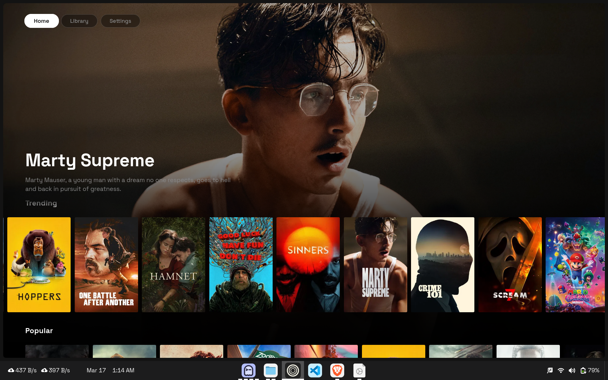

# ALEX TV

A sleek Android TV app for browsing movies and TV shows, powered by TMDB.



## Features

- Browse Trending, Popular, Top Rated, Now Playing, and Upcoming movies
- Popular and Latest TV series
- Full-screen hero backdrop that updates as you navigate
- D-pad spatial navigation optimized for Android TV remotes
- Skeleton loading animations
- Dark, minimal UI built with Space Grotesk

## Download

Grab the latest APK from [Releases](https://github.com/lunatestus/ALEX-TV/releases/tag/latest).

## Tech Stack

- **Android WebView** — wraps a lightweight HTML/CSS/JS frontend
- **Kotlin** — native Android TV shell with D-pad key mapping
- **TMDB API** — movie and TV show data
- **GitHub Actions** — automated builds with rolling release

## Build

The app builds automatically via GitHub Actions on every push to `main`. To build locally:

```bash
./gradlew assembleDebug
```

APK output: `app/build/outputs/apk/debug/app-debug.apk`

## License

MIT
